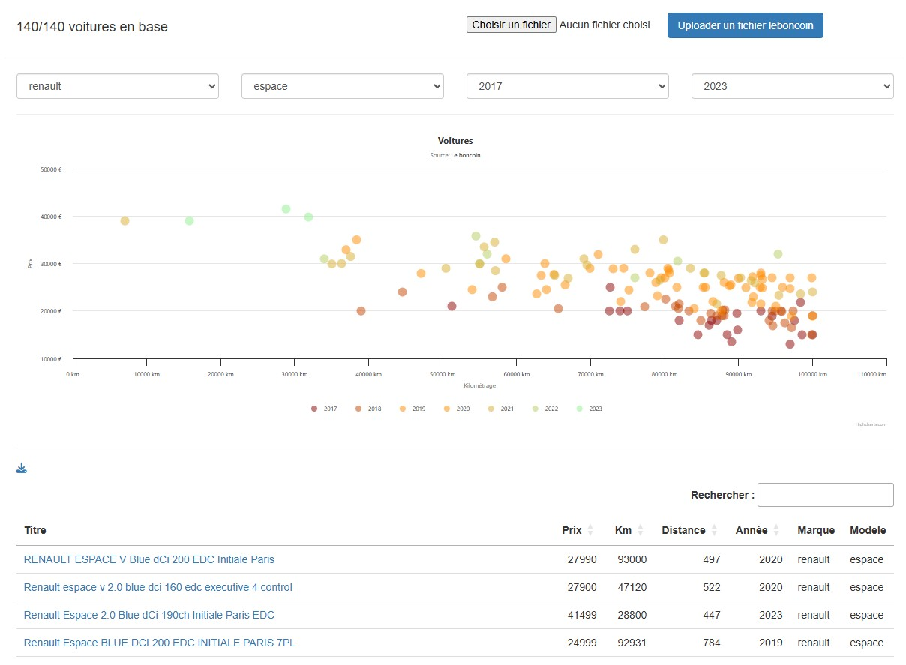

LeBoncoin Scraper

## About 

This app contains a chrome plugin to download leboncoin cars informations. Then you can
upload it on the Laravel web application to see what is the better car to buy.

## Screenshot

## Plugin Installation
In chrome extension, add non package plugin (public/plugin)
Go to <a href='https://www.leboncoin.fr/recherche?category=2&locations=Nantes__47.23016052688833_-1.547806468993706_8804_5000&u_car_brand=RENAULT&u_car_model=RENAULT_Scenic'>leboncoin.fr cars category</a>
Click and the plugin button on the toolbar then get the scraped_articles.json file.
/!\ Take car if you download many many informations, and use a VPN.

## Installation

``
composer install
set POSTCODE in your .env with your postal code
``
## Usage

On the form on the top, upload the scraped_articles.json file then navigate in the category.

## License

The Laravel framework is open-sourced software licensed under the [MIT license](https://opensource.org/licenses/MIT).
