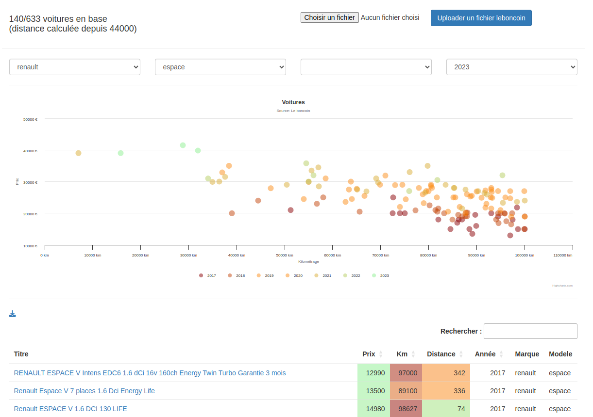

<h1>LeBoncoin Scraper</h1>

<p>
    <a href="https://packagist.org/packages/laravel/framework"></a>
</p>

## About 

- This app contains a chrome plugin to download leboncoin cars informations. 
- Then you can upload it on the Laravel web application to see what is the better car to buy.

## Screenshot



## Plugin Installation

- In chrome extension, add non package plugin (public/plugin)
- Go to <a href='https://www.leboncoin.fr/recherche?category=2&locations=Nantes__47.23016052688833_-1.547806468993706_8804_5000&u_car_brand=RENAULT&u_car_model=RENAULT_Scenic'>leboncoin.fr cars category</a>
- Add your own car filters 
- Click on the plugin button on the toolbar then get the scraped_articles.json file.

/!\ Take car if you download many many informations, maybe you need to use a VPN to avoid IP block.

## Installation

````
cp .env.example .env
php artisan key:generate
composer install
set POSTCODE in your .env with your postal code (default = 44000)
````

## Usage

- On the form on the top, upload the scraped_articles.json file then navigate in the category.
- You have an example of this file on the public directory.

## License

The Laravel framework is open-sourced software licensed under the [MIT license](https://opensource.org/licenses/MIT).
